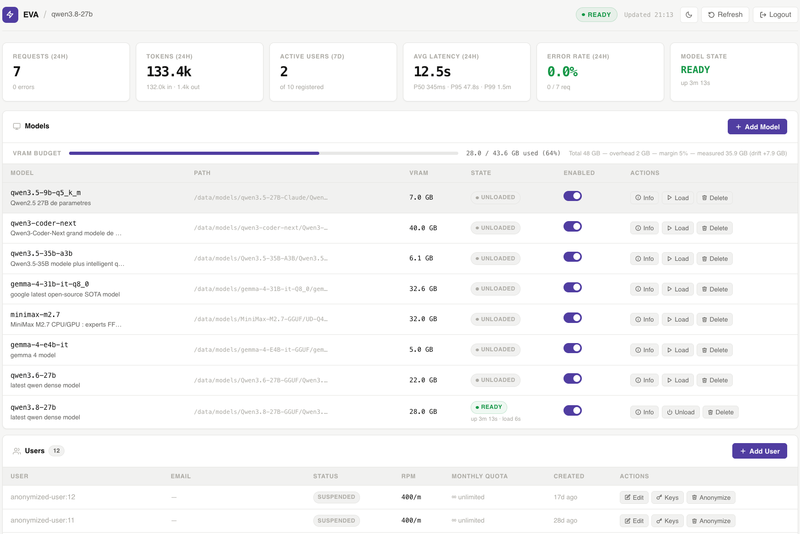

# EVARuntime

**Private LLM inference for shared GPUs. Load a model when it is needed; give the memory back when it is idle.**

EVARuntime is a self-hosted control plane for running `llama.cpp` models on shared GPU machines. Your applications use an OpenAI-style API; EVARuntime decides which GGUF model to run, when to start its `llama-server` process, who may use it, and when that process can safely stop. Prompts, models, keys and usage records stay on infrastructure you operate.

It is built for labs and small platform teams that share GPU machines between inference and other work, and want predictable operations without a Kubernetes stack.



*One model is ready and seven are unloaded in this dashboard snapshot. It is not a measured before-and-after VRAM result.*

## Why it exists

Keeping a model resident reserves GPU memory even when nobody is asking it anything. On a shared machine, that memory could be used for another model, an experiment or training. EVARuntime makes the model lifecycle part of the service rather than an operator chore.

`llama.cpp` generates the tokens. EVARuntime handles admission, access, lifecycle and observability around it:

```text
UNLOADED ── request ──> LOADING ──> READY ── idle ──> UNLOADING ──> UNLOADED
                                   │
                                   └── active requests keep the model pinned
```

If capacity is tight, requests wait in a bounded queue and an inactive model can be evicted. An active response keeps its model pinned; stream completion and client disconnect both release that pin.

## Why not use another server directly?

<details>
<summary>Why not just llama.cpp?</summary>

`llama-server` already has a router that can load models on demand. Use it directly if that covers your needs. EVARuntime adds a separate control plane for user keys and quotas, VRAM admission, persistent usage records, artifact checks and optional placement across nodes. [llama.cpp router docs](https://github.com/ggml-org/llama.cpp/blob/master/tools/server/README.md#using-multiple-models)

</details>

<details>
<summary>Why not Ollama?</summary>

Ollama also unloads idle models and queues requests. EVARuntime is for operators who want to manage their own GGUF and `llama-server` deployment while giving multiple users controlled access, quotas and usage history. Choose the workflow that fits your team. [Ollama FAQ](https://docs.ollama.com/faq)

</details>

<details>
<summary>Why not vLLM?</summary>

vLLM focuses on high-throughput inference and has a sleep mode. EVARuntime currently manages `llama.cpp` and GGUF; vLLM support is roadmap work, not a current backend. [vLLM sleep mode](https://docs.vllm.ai/en/latest/features/sleep_mode/)

</details>

## What works today

- **Local inference:** gateway-owned `llama-server` processes for GGUF models on Linux with NVIDIA GPUs or macOS with Apple Silicon and Metal.
- **Familiar client API:** authenticated `/v1/chat/completions`, SSE streaming and `/v1/models`, with the model ID taken from the validated YAML registry.
- **Shared GPU control:** on-demand loading, VRAM and port budgets, coalesced concurrent loads, idle unload and LRU eviction of inactive models.
- **Access and audit:** per-user API keys stored as hashes, rate limits, monthly token quotas, usage records and user anonymization.
- **Artifact controls:** validated model paths and optional GGUF SHA-256 checks before loading.
- **Operations:** an admin dashboard, Prometheus metrics, structural `/ready` checks, `doctor`, a first-token smoke test and deployment scripts for Linux and macOS.
- **Optional multi-node mode:** a Linux orchestrator can place models on separately installed GPU node agents, reconcile their state and fail over when a node becomes unavailable.

The stack stays deliberately small: FastAPI, SQLite WAL, `llama.cpp`, and systemd or launchd. See the [architecture](docs/architecture.md) for the request path and lifecycle invariants.

## Get a first token

You need Python 3.11+, a working `llama-server` build and a GGUF model. The installer sets up the gateway; it does **not** download or compile the inference runtime or model for you.

| Where you run it | Start here |
| --- | --- |
| Linux with NVIDIA GPU | [Local first-token walkthrough](docs/deployment.md#déploiement-local--premier-token-linux), from CUDA build to smoke test |
| macOS 14+ on Apple Silicon | [macOS local installation](docs/deployment.md#déploiement-macos-apple-silicon), including Metal and model registration |
| Several Linux GPU nodes | [Multi-node deployment](docs/deployment.md#13-déploiement-multi-nœuds-optionnel--avancé), after understanding the [cluster limits](#current-limits) |

On Linux, you can preview the installer before changing the host:

```bash
git clone https://github.com/Tutanka01/EVARuntime.git
cd EVARuntime
bash gateway/deploy/install.sh --mode local --dry-run
```

Follow the linked walkthrough to prepare the runtime and model, install the service, then run `smoke_test.sh`. `/ready` checks whether the gateway is structurally ready; the smoke test actually loads a model and checks the first streamed token.

Once an admin has [created a user API key](docs/deployment.md#première-requête-authentifiée), an existing OpenAI Python client can call the gateway:

```python
import os
from openai import OpenAI

client = OpenAI(
    base_url="http://127.0.0.1:8000/v1",
    api_key=os.environ["EVA_API_KEY"],
)

stream = client.chat.completions.create(
    model=os.environ["EVA_MODEL_ID"],  # an id returned by GET /v1/models
    messages=[{"role": "user", "content": "Hello, EVA."}],
    stream=True,
)
for chunk in stream:
    print(chunk.choices[0].delta.content or "", end="", flush=True)
```

The first request may wait while the model loads. Set `EVA_API_KEY` to a **user** key (`llmgw-…`), not the admin secret, and `EVA_MODEL_ID` to an ID from your registry. For curl, request options and error handling, see the [API guide](docs/api.md).

## Current limits

More than 2,500 gateway tests and a separate node-agent suite exercise lifecycle, scheduling, artifact integrity, access control, quotas and failure handling; see the [dated results](ROADMAP.md#vérification-locale-du-3-septembre-2026). That is software evidence.

A reproducible, published end-to-end report on real GPU hardware, GGUF and nginx is still [roadmap work](ROADMAP.md#r1--preuve-terrain-et-cluster-qualifié); the dashboard snapshot above is not that evidence.

Multi-node mode places **whole models** on nodes; it does not split one model across machines. Its data-plane traffic currently uses HTTP, so cluster experiments belong on a private, firewalled LAN. An encrypted data plane and real-process cluster failure tests are required before claiming production use with sensitive prompts. See the [deployment guide](docs/deployment.md#13-déploiement-multi-nœuds-optionnel--avancé) and [roadmap](ROADMAP.md).

Energy accounting, vLLM, and distributed model execution are goals, not shipped features. The [product vision](docs/vision.md) explains why they matter; the [roadmap](ROADMAP.md) tracks what must be proven first.

## Explore the project

| Topic | Where to go |
| --- | --- |
| Current design and invariants | [Architecture](docs/architecture.md) |
| Client routes and examples | [API guide](docs/api.md) |
| Admin users, models and dashboard | [Admin guide](docs/admin.md) |
| Installation, upgrades and recovery | [Deployment guide](docs/deployment.md) |
| Model and gateway settings | [Model registry](gateway/models.yaml) and [environment template](gateway/.env.example) |
| Readiness, metrics and logs | [Observability guide](docs/observability.md) |
| Priorities and known defects | [Roadmap](ROADMAP.md) |

Bug reports and focused contributions are welcome through [GitHub Issues](https://github.com/Tutanka01/EVARuntime/issues). Please include the platform, a way to reproduce the problem and logs with secrets removed.

EVARuntime was created by **Mohamad El Akhal** at the **Université de Pau et des Pays de l'Adour (UPPA)**. Licensed under [AGPL-3.0](LICENSE).
